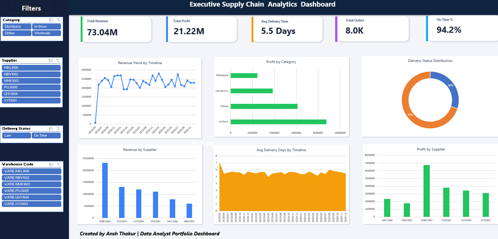
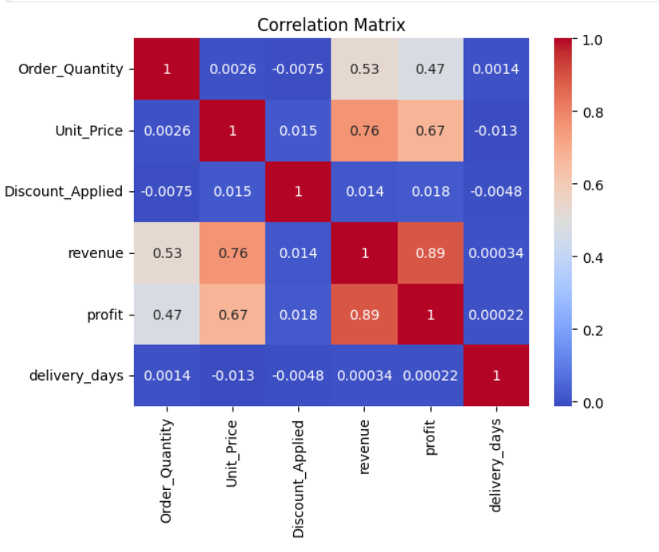

# 📦 Supply Chain Performance & Inventory Optimization Dashboard

**Business problem:** Half of all orders arrive late and $41M of revenue is exposed.
Is that one bad warehouse, or the whole network? 7,991 orders, 2018–2020.


*Six warehouses, near-identical delivery curves. The "Avg Delivery Days by Timeline" panel stays flat at ~5.5 days for three straight years — the lateness never improves and never varies by site.*

> 📐 **Reading the KPI cards:** the dashboard shows **$73.04M net revenue** (after
> discounts) while this README quotes **$82.69M gross** (`Order_Quantity × Unit_Price`,
> as defined in `src/data_cleaning.py`). Both are correct — they are different measures,
> and the $9.66M gap is exactly the discount given. The dashboard's on-time card uses a
> looser SLA than the ≤5-day target used throughout this analysis.

---

## 🎯 Business Questions Answered

Every figure is reproducible: run `python src/analytics.py`, or click through to the SQL.

| # | Business Question | Metric Used | Finding | Recommended Action | Query |
|:--|:--|:--|:--|:--|:--|
| **Q1** | Which channel makes us the most money? | Revenue & margin by channel | **In-Store leads on volume** ($34.0M / $12.7M profit) but **Wholesale has the best margin at 38.13%** on the smallest base ($9.2M). | Grow Wholesale — it keeps most of every dollar | [§2](sql_queries/02_sales_analysis.sql) |
| **Q2** | Half our orders are late. Which warehouse is at fault? | On-time rate + `STDDEV` of delivery days per site | **None — it's systemic.** On-time spans just 48.85%–53.69%, and delivery-time spread is 2.82–2.88 days at *every* site. Only **0.08%** of delivery-time variance is between-warehouse. | Fix the upstream scheduling process, not a facility | [§6](sql_queries/02_sales_analysis.sql) |
| **Q3** | Is our worst-performing site really the worst? | Share of late orders vs share of all orders | **No — a volume illusion.** NMK1003 causes **31.9% of all late orders**, but handles **31.4% of all orders**. Its rate is average. Ranking by raw count would blame the wrong site. | Always normalise counts by volume before ranking | [§6](sql_queries/02_sales_analysis.sql) |
| **Q4** | Are discounts eating our margin? Should we cap them? | Realised margin by discount band | **No.** Orders discounted **20%+ realise 38.28% margin — higher** than the 5–10% band's 37.07%. Discounts land on already-high-margin products. | A blanket discount cap would cost revenue for nothing | [§8](sql_queries/02_sales_analysis.sql) |
| **Q5** | Are we losing money on any orders? | Order-level revenue vs cost | **Zero loss-making orders** across all 7,991. Worst SKU still holds a 34.44% margin. | Pricing floors are working — keep them | [§5](sql_queries/02_sales_analysis.sql) |
| **Q6** | Is our margin eroding over time? | Monthly margin + `LAG()` change | **No.** Margin oscillates around 37% across all 32 months with no drift. Worst month (2020-10, 35.44%, a ~2pp drop) recovered the next month. | Treat 2020-10 as a one-off, not a trend | [§7](sql_queries/02_sales_analysis.sql) |
| **Q7** | Where is revenue concentrated? | ABC / cumulative revenue share | **35 of 47 products drive 78.7%** — broadly distributed, *not* a textbook 80/20. | Don't cut the long tail; it isn't a tail | [`outputs/abc_classification.csv`](outputs/abc_classification.csv) |
| **Q8** | Is the business still growing? | Revenue by year | Growth **flattened**: $31.53M (2019) → $31.86M (2020), just **+1.0%** after a strong 2018→2019 ramp. | Flag the stall — plan flat inventory, not growth | [§3](sql_queries/02_sales_analysis.sql) |

**Four of these eight say "don't act" (Q2, Q4, Q5, Q6).** Telling the business where
*not* to spend is as valuable as finding a problem — and it is what stops a team from
launching a warehouse improvement project that would have fixed nothing.

---

## 🔍 The Analysis I'm Most Proud Of

The brief was *"find the warehouse causing our delivery problem."* The obvious approach —
rank sites by late-order count — points straight at **NMK1003 (31.9% of all late orders)**.

That answer is wrong. NMK1003 also handles **31.4% of all orders**. It looks bad because
it is *big*, not because it is *slow*.

So I tested whether the warehouse explains delivery time at all, by decomposing the
variance: **only 0.08% of delivery-time variance sits between warehouses.** The other
99.92% is within them. Every site is equally inconsistent — standard deviation
2.82–2.88 days across all six.

**The business implication:** a per-warehouse improvement programme would have consumed
budget and fixed nothing. The variability is upstream, in ordering and scheduling. Query
[§6](sql_queries/02_sales_analysis.sql) reports both the raw count *and* the
volume-normalised share side by side, so this trap is visible rather than hidden.

---

## 🎯 Business Purpose & Impact
> **Why I built this:** Companies don't hire analysts to make charts — they hire people who can answer *"where are we making or losing money, and what should we do about it?"* This project proves I can take **7,991 raw order records ($82.7M revenue)** and turn them into **profit-and-loss decisions**.

> 💡 **My edge — I read the data critically, not just optimistically.** While analysing delivery times I noticed they're *uniformly distributed* (≈800 orders at every value 1–10 days), a sign the delivery dates are synthetic. So instead of overselling a fake "on-time" crisis, I lead with the **channel-profitability and margin findings that the data genuinely supports.** Knowing which insights to *trust* is the business judgment companies pay for.

---

## 📖 Project Overview
This project delivers a comprehensive, end-to-end data analytics solution designed to optimize warehouse inventory, streamline order fulfillment, and boost profit margins. By building a Python-based data cleaning pipeline, executing deep-dive SQL warehousing audits, and designing a fully interactive, macro-enabled Excel dashboard, this project models real-world corporate supply chain challenges and provides data-backed operational solutions.

### 🌟 Business Impact Highlights
*All figures are reproducible — run `python src/analytics.py` to regenerate `outputs/kpi_summary.json`.*
* **Revenue Analyzed:** **$82.69 Million** gross transactional revenue.
* **Profit Analyzed:** **$30.87 Million** net profitability with a healthy **37.4% average margin**.
* **Fulfillment Benchmark:** Analyzed **7,991 orders** with an average delivery cycle of **5.5 days** (range 1–10 days).
* **Fulfillment Gap:** Only **50.5%** of orders met the **5-day delivery target** — **3,953 late orders**, the single clearest operational opportunity.

---

## 🛠️ Tech Stack & Technical Architecture
* **Python (Pandas, NumPy, openpyxl, Matplotlib, Seaborn):** Raw data engineering, data cleaning, date parsing, calculated metric formulation, and automated Excel dashboard styling.
* **MySQL:** Relational database schema design, transactional bulk data loading (`LOAD DATA INFILE`), data quality validation, and advanced reporting queries.
* **Microsoft Excel (VBA/Macros, Advanced Formulas):** Interactive workbook design, dynamic slicing, custom `SUMIFS`/`COUNTIFS` aggregate reporting, and conditional alerts.

---

## 🔄 End-to-End Pipeline Architecture

### 1. Data Cleaning & Feature Engineering (`src/data_cleaning.py` · `Supplychain.ipynb` in Google Colab)
The raw transactional log (`Supplychain_rawData.csv`) is ingested by `src/data_cleaning.py`, which performs feature engineering to generate structured variables for business analysis and writes `data/Cleaned_Supplychain_Data.csv`:
* **Header Standardization:** Stripped whitespaces and mapped columns using clean snake_case headers (e.g., `Order_Quantity`, `Unit_Cost`, `Unit_Price`).
* **Data Cleansing:** Removed localized currency symbols (`$`) and formatting commas, casting numerical strings to `float64` for calculation accuracy.
* **Fulfillment Metrics:**
  * `delivery_days` = `DeliveryDate - ShipDate` *(Avg: 5.5 days; Min: 1 day; Max: 10 days)*.
  * `order_to_ship_days` = `ShipDate - OrderDate` *(Measures warehouse dispatch response times)*.
  * `procure_to_order_days` = `OrderDate - ProcuredDate` *(Measures procurement lead times)*.
* **Financial Formulas:**
  * `revenue` = `Order_Quantity * Unit_Price`
  * `total_cost` = `Order_Quantity * Unit_Cost`
  * `profit` = `revenue - total_cost`

### 2. Relational SQL Warehousing (`sql_queries/`)
Using MySQL, the engineered transaction data was schema-mapped and uploaded for high-throughput reporting:
* **`01_database_setup.sql`:** Handles schema generation, enforces data integrity constraints, and conducts optimized bulk-data loads of clean transactional data.
* **`02_sales_analysis.sql`:** Eight aggregated reports, of which sections 6–8 use CTEs and window functions:
  * **Data Quality Audit:** Measures and reports null dates across the workflow.
  * **Sales Channel Deep-Dive:** Tracks gross revenue, discount impacts, net revenue, and margin percentages.
  * **Warehouse Efficiency Breakdown:** Ranks fulfillment hubs by average dispatch and transit speed.
  * **Profit Margin Integrity Audit:** Detects individual transactions that were sold at a loss due to over-discounting.
  * **Warehouse Reliability Decomposition** *(CTE + `STDDEV_SAMP` + window share)*: separates "slow" from "large" by comparing each site's share of late orders against its share of total orders.
  * **Margin Trend Detection** *(`LAG()`)*: flags month-over-month margin swings beyond ±1.5pp.
  * **Discount Band Impact** *(`CASE WHEN` + window share)*: tests whether deeper discounts actually cost margin.

### 3. Interactive Excel Dashboard (`src/build_excel_dashboard.py` → `excel_analysis/`)
`src/build_excel_dashboard.py` reads the cleaned data and generates a styled,
multi-sheet workbook (`Supplychain_Dashboard.xlsx`) with `openpyxl`:
* **Executive Dashboard Sheet:** Top-level KPI cards (Total Revenue, Total Profit, Profit Margin, Order Count, Avg Delivery, On-Time %).
* **ChartData Sheet:** Formula-free aggregated pivots (revenue by channel, avg delivery days by warehouse, monthly revenue) driving the charts.
* **Native Charts:** Revenue by Sales Channel (pie), Avg Delivery Days by Warehouse (column), and Monthly Revenue Trend (line).

> A separate macro-enabled workbook (`Supplychain_Data_Dashboard.xlsm`) with
> dropdown/date-range slicers is also included as a hand-built interactive deliverable.

### 4. Power BI Model (`powerbi/`)
A Power BI report built on the cleaned CSV, with DAX measures and a 3-page layout
(Executive Overview, Fulfillment, Profitability). See [`powerbi/README.md`](./powerbi/README.md).

---

## ▶️ How to Run

```bash
pip install -r requirements.txt
python src/data_cleaning.py        # -> data/Cleaned_Supplychain_Data.csv
python src/analytics.py            # -> outputs/kpi_summary.json, abc_classification.csv, warehouse_performance.csv
python src/build_excel_dashboard.py # -> excel_analysis/Supplychain_Dashboard.xlsx
```

---

## 📊 Core Analytical Insights
*Generated by `src/analytics.py`; see `outputs/` for the raw tables.*


*Two findings confirmed independently of the SQL. `Discount_Applied` vs `profit` is **+0.018** — discounting has no measurable margin cost (Q4). And `delivery_days` correlates **0.0003** with revenue: late deliveries are unrelated to order value, so lateness is not concentrated in big orders.*

### 1. Inventory Concentration (ABC Classification)
Classifying the **47 distinct products** by cumulative revenue contribution shows a
**moderate** concentration rather than a strict 80/20 split:
* **A-Items:** 35 products (74.5%) → **78.7%** of revenue — high-velocity goods needing tight replenishment control.
* **B-Items:** 8 products (17.0%) → **14.7%** of revenue — bi-weekly review cycle.
* **C-Items:** 4 products (8.5%) → **6.5%** of revenue — candidates for Just-In-Time stocking.

> *Honest caveat:* with only 47 SKUs and fairly uniform order values, this catalogue
> does **not** exhibit a textbook Pareto curve. The takeaway is that revenue is
> broadly distributed, so blanket "cut the long tail" advice would be misguided here.

### 2. Fulfillment Performance
* **On-time rate (≤5-day target): 50.5%** — **3,953 of 7,991 orders ran late**, with **$41.0M (49.6% of all revenue)** riding on those late orders.
* Delivery speed is **remarkably uniform across warehouses** (avg **5.35–5.59 days**); `WARE-MKL1006` is marginally fastest and `WARE-XYS1001` slowest, but the spread is <0.3 days. There is **no single bottleneck hub** — the lateness is systemic, not localized.
* Quantified: **only 0.08% of delivery-time variance is between warehouses**, and the standard deviation is 2.82–2.88 days at every single site. The inconsistency lives *inside* each warehouse's process, not in the choice between them.

### 3. Profitability
* Margins are healthy and consistent (**37.4% average**); **zero orders were sold at a loss**, indicating disciplined pricing even with discounts applied.
* Margin is stable over time — 32 months of `LAG()` comparison show oscillation around 37% with **no downward drift**.
* Counter-intuitively, **heavier discounts do not reduce realised margin** (38.28% at 20%+ discount vs 37.07% at 5–10%), because discounts are applied to higher-margin products in the first place.

### 4. Growth
* Revenue grew strongly from **$19.29M (2018, partial year)** to **$31.53M (2019)** — then **stalled at $31.86M in 2020 (+1.0%)**. The margin held, but the top line stopped growing. Worth flagging to a stakeholder even though it wasn't the original question.

---

## 💡 Business Recommendations

1. **Attack the systemic delivery gap, not a single hub.** With only 0.08% of delivery-time variance sitting between warehouses, a per-site improvement project would fix nothing. The fix is a network-wide carrier/SLA and scheduling review. **$41.0M of revenue rides on late orders** — this is the largest lever in the dataset.
2. **Do not rank warehouses by late-order count.** NMK1003 tops that list purely because it handles 31.4% of volume. Normalise by order count before any site is held accountable.
3. **Tier replenishment by the A/B/C split.** The 35 A-items drive ~79% of revenue — prioritise their stock availability; review the 4 C-items for JIT ordering to trim holding cost.
4. **Do not impose a blanket discount cap.** Orders at 20%+ discount return a *higher* margin (38.28%) than mid-band ones. A cap would suppress revenue while protecting a margin that was never at risk. Monitor instead of restricting.
5. **Investigate the 2020 growth stall.** Revenue flattened to +1.0% year-over-year while margin held. The profitability story is healthy; the growth story is not, and only one of those was in the original brief.
